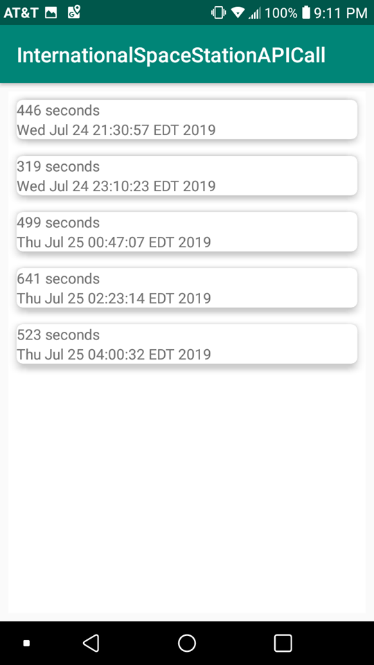

# InternationalSpaceStationAPI
ISS API Call

Coding

Coding Challenge: International Space Station Passes

GOAL: Verify candidate can provide a technical solution and follow instructions.
REQUIREMENTS: 
These requirements are rather high-level and vague. If details are omitted, it is because we will be happy with any of a wide variety of solutions. Don't worry about finding "the" solution.
1.	Read about the following ISS Pass Times API here: http://open-notify.org/Open-Notify-API/ISS-Pass-Times/
2.	Obtain the device’s GPS coordinates, if available, and pass them to the service.
3.	In a list, display each “pass” of the ISS for the given coordinates.
4.	Each item on the list should at minimum display the duration in seconds, as well as the time (convert to readable timestamp).
In order to prevent you from running down rabbit holes that are less important to us, try to prioritize the following:
What is Important
•	Proper function – requirements met.
•	Well-constructed, easy-to-follow, commented code (especially comment hacks or workarounds made in the interest of expediency (i.e. // given more time I would prefer to wrap this in a blah blah blah pattern blah blah )).
•	Proper separation of concerns and best-practice coding patterns.
•	Defensive code that graciously handles unexpected edge cases.
What is Less Important
•	UI design – generally, design is handled by a dedicated team in our group.
•	Demonstrating technologies or techniques you are not already familiar with.

Instructions:

- Run the Android project
- Create a new Virtual Device if not already. Then, choose Pixel 2 XL, then click OK.
- It will display the list of passes with its duration and time based on the device coordinate.

